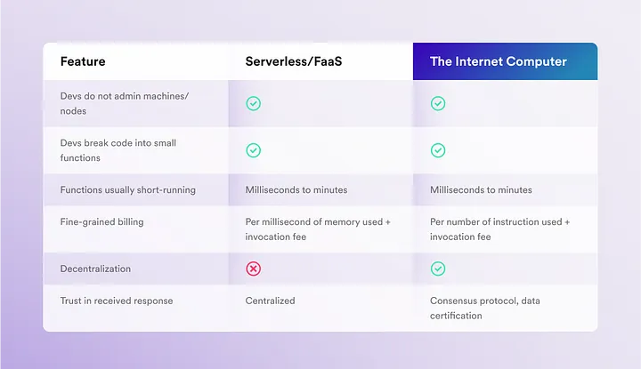
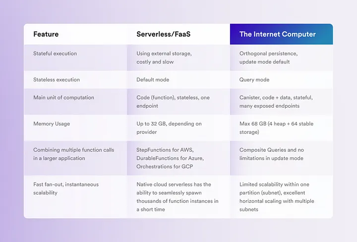
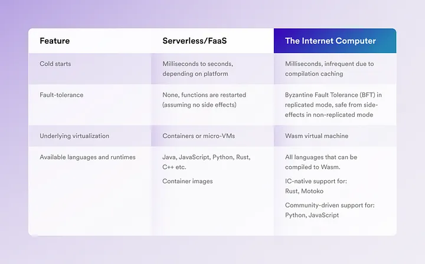
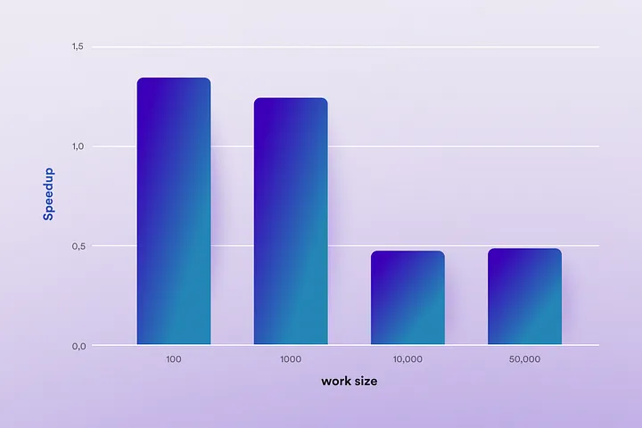
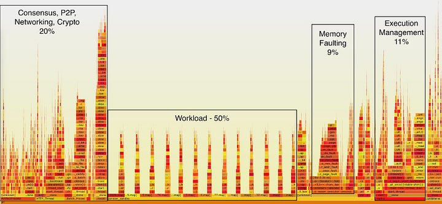

---
title: The Internet Computer: A blockchain that offers stateful decentralized serverless computing
description: Is serverless computation even possible on a blockchain platform? Our recent peer-reviewed article shows that the Internet Computer provides serverless computation comparable to existing cloud providers, but with the added benefits of decentralization and statefulness.
tags: [Technology]
author: Alexandru Uta
image: /img/blog/serverless.webp
---

# The Internet Computer: A blockchain that offers stateful decentralized serverless computing

Serverless has taken the cloud computing world by storm, seeing large growth in the past few years with really positive projections for the future. As per a recent forecast, the market is expected to grow at a compound annual growth rate of over 20% by 2028. Essentially, serverless architectures push cloud-based tech to its full potential through IT automation software, enabling enterprises to propel growth rather than spending time and resources on IT infrastructure management.

While this sounds highly promising, serverless cloud platforms are still stateless and centralized. Applications therefore need to work around this shortcoming for storing state, and to avoid being subject to vendor lock-in. The Internet Computer offers another layer of security, control, and trust — all through decentralization, whereby no one single party controls the hardware or the software. Moreover, the Internet Computer operates by design in a stateful manner.

In this post we describe how the Internet Computer blockchain offers serverless computing functionality with two important additional benefits: decentralization and statefulness.

## What is serverless?

Serverless is a novel cloud computing paradigm that enables quick and agile development cycles without minding the underlying infrastructure — provisioning and scaling the right virtual machines, installing and maintaining software and frameworks — reducing overall operational costs. There are several incarnations of severless and the most relevant in our case is function-as-a-service (FaaS), where (large codebases are split into) small functions (that) run for very short periods of time (milliseconds to minutes). Functions are charged for per use (i.e., based on how long they run) plus a fixed fee per invocation. The last important feature to mention is the excellent scaling capability, where up to thousands of instances of the same function can be started in a short span of time.

## The Internet Computer as a serverless platform

Taking a brief glimpse at the architecture of the Internet Computer, you will easily notice that it offers serverless features with even extra benefits. Nowadays FaaS functions are packaged as containers or simply as code (in Python, Javascript, Java, Rust etc.), and offer a single endpoint that can either be called directly by external users or other functions. Canister smart contracts on the Internet Computer can also be programmed in several languages, including Rust, Motoko, JavaScript or Python, and can expose multiple endpoints that can offer different functionality per canister. The tables below summarize the main serverless features and their Internet Computer correspondents, as well as the advantages the blockchain has over cloud-based serverless.

*Table 1. Main serverless features contrasted with the Internet Computer capabilities. Decentralization, statefulness and trust are added benefits of the Internet Computer*

As can be seen from the tables, the Internet Computer ticks all the boxes of a serverless environment. Developers may not know it, but they are already executing serverless code and as our research shows — at nearly the same efficiency as traditional cloud vendors offer. And on select dimensions (e.g. memory) the Internet Computer even exceeds the power offered by traditional cloud vendors. However, the most important developer-facing features we’d like to highlight are: statefulness and decentralization, neither of which are offered by traditional serverless clouds.

In Tables 2–3, we invite the tech-savvy reader to dive deeper into the technical aspects that enable the Internet Computer to be a competitive serverless platform. It is important to note here that the Internet Computer has two types of executing smart contracts — an update mode and a query mode. The former represents a stateful invocation, while the latter is stateless, just like generic serverless computing.

*Table 2. Important features for building large-scale serverless applications. Statefulness is an added benefit of the Internet Computer.*

*Table 3. In-depth platform analysis regarding runtime-related features.*

Keeping state after function execution is a long sought-after feature in the serverless/FaaS world. It is highly difficult to implement as it generally conflicts with the seamless fan-out type of scalability offered in current clouds. Fortunately, the Internet Computer is designed with statefulness in mind from the ground up and offers developers this feature without any kind of manual intervention, like saving data to an outside storage layer or database. Therefore, all variables or data are automatically persisted after a smart contract invocation on the Internet Computer.

Decentralization is yet another important feature that is often overlooked. Modern serverless offerings are currently offered by several large centralized clouds, which leads to vendor lock-in. In this case, developer code and data are as secure as their provider is and are liable to geographical outages or simply vendor policy change. The Internet Computer is fully decentralized, with node machines operating in different geographies and running under strong consensus guarantees, tolerating even byzantine (malicious) faults.

## The Internet Computer vs. traditional serverless platforms

To assess how the Internet Computer blockchain fares against serverless clouds, we ran a CPU intensive benchmark computing prime numbers on the Internet Computer and on one of the top-3 serverless platforms. For small inputs, the Internet Computer is faster than traditional serverless whereas for larger inputs, it is half as fast (see results in the figure below). This is extremely encouraging. This shows that while there’s still a long way to go, the Internet Computer is gaining traction in terms of performance when compared to traditional, centralized clouds. For more detailed information we encourage you to check out our recent peer-reviewed article presented at the prestigious USENIX ATC conference.

*Fig 1. Speedup vs. top-3 serverless platform.*

## Increasing performance

Extra built-in features such as decentralization and statefulness are what make the Internet Computer performance for large workloads lower (see Figure 2). While these features are extremely powerful and important, they also eat away at raw performance.

*Fig 2. The decentralization and statefulness overheads of the Internet Computer.*

DFINITY engineers and researchers will continue to search and explore ways to enhance and improve the performance of the Internet Computer. Some areas of improvement could be increasing parallelism or replacing the current storage layer with a log-structured merge tree approach to improve checkpointing time.

Unleashing the full power of composite queries to enable more complex applications will also have a positive impact on performance. Work on composite queries has already begun to enable horizontal dapp scaling and to simplify client-side code. Further engineering to allow cross-subnet query calls and replicated execution is underway.

Build serverless applications on the Internet Computer [here](https://internetcomputer.org/docs/current/home).

Run an enterprise pilot the Internet Computer [here](https://internetcomputer.org/enterprise).
